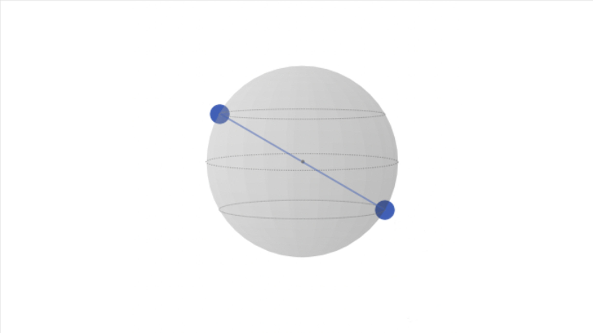

# Quantum Tasks: GHZ States with 3 Qubits

In this Tasks, you will work with three qubits to create GHZ states using Qiskit. GHZ states are an important type of entangled states that have applications in quantum communication and quantum information processing. Your goal is to implement circuits for GHZ states and analyze their properties.

## Task 1: Building GHZ State Circuits

In this task, you will create Qiskit circuits to prepare GHZ states using three qubits.

### Steps:
1. Set up your Python environment with Qiskit and import the required libraries.
2. Create a Qiskit circuit to generate a GHZ state with three qubits.
3. Use quantum gates and operations to entangle the three qubits and form the GHZ state.
4. Add measurements to the circuit to observe the final state.
5. Use Qiskit's visualization tools to display the statevector and/or density matrix of the GHZ state created
-------------------------------------
# Task 2 : Build a circuit with 4 qubits for the Qiskit logo state shown by the following Qsphere:

